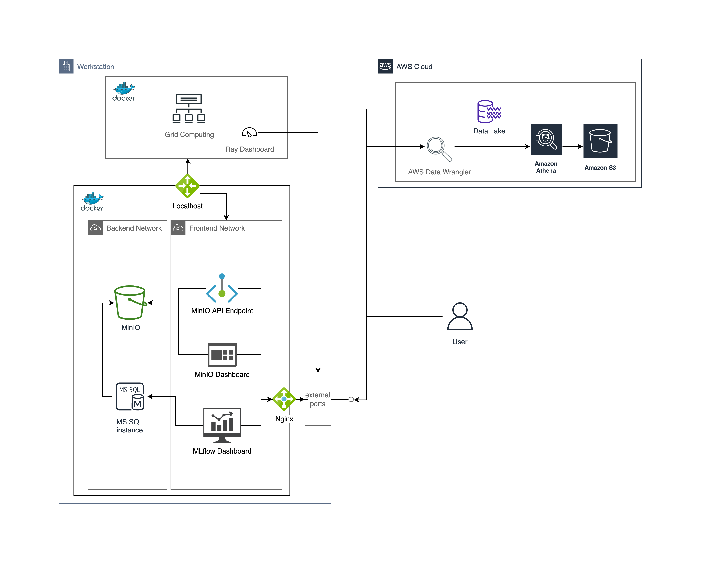

AWS Data Wrangler
=================

A data lake is a centralized repository that allows you to store all
your structured and unstructured data at any scale.
You can store your data as-is,
without having to first structure the data,
and run different types of analytics—from dashboards and visualizations
to big data processing, real-time analytics,
and machine learning to guide better decisions.

For these reasons, for data analysis, we highly rely on
`AWS Data Wrangler <https://aws-data-wrangler.readthedocs.io/
en/stable/tutorials/001%20-%20Introduction.html>`_.
