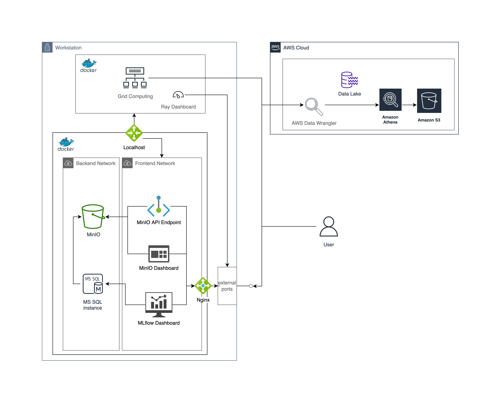

MLflow Dashboard
================

The concept of MLOps a set of practices that aims to deploy and maintain
machine learning models in production reliably and efficiently.
We adopt `MLFlow <https://mlflow.org/>`_,
an open source platform for the machine learning lifecycle.
In our using practice, it's essential to keep on track of every experiments.
`MLflow Tracking <https://mlflow.org/docs/latest/tracking.html#>`_
provides such functionality.

Components
~~~~~~~~~~
The tracking server is hosted on our workstation,
composed by 3 containerized services,

#. A backend storage (database)
    We use MySQL instance.
#. An artifact store
    We use `MinIO <https://min.io/>`_, a high-performance, S3 compatible object storage.
#. Mlflow server itself

Dashboards
~~~~~~~~~~
There are 2 frontend user-facing dashboards,

#. MLflow dashboard
    The MLFlow Tracking dashboard allows you to visualize, search and compare runs,
    as well as download run artifacts or metadata for analysis in other tools.
#. MinIO dashboard
    MinIO itself provides 2 accessing methods.
    One can view artifacts on dashboard, or use API endpoint for programmatic control.

    |
    For programmatic access, one can refer to

    .. autosummary::
        :toctree: _autosummary

        mbl.analysis.run_searcher

The internet
~~~~~~~~~~~~
To protect the services, an `nginx <https://www.nginx.com/>`_
load balancer is put in front of the real services.
Internally, services are running in Docker virtual network,
and are separated from the host network.

#. Frontend network
#. Backend network
